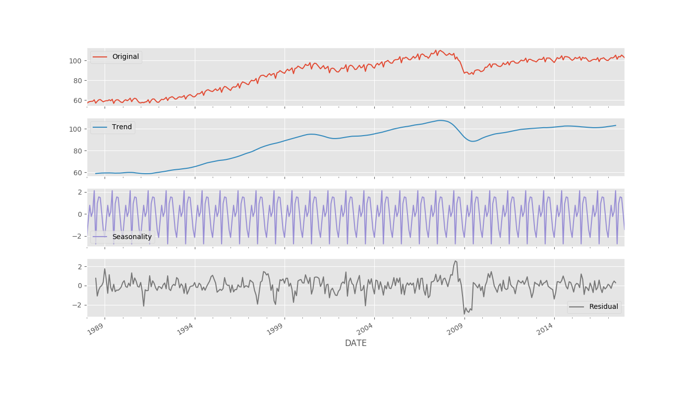
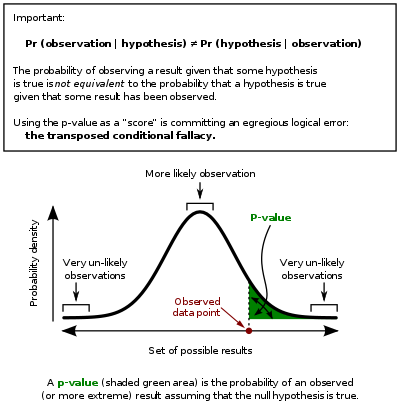

# Machine Learning for Algo Trading

## Time Series Models

A time series is often modelled as a stochastic process consisting of a collection of random variables with one variable for each point in time.

Univariate time series: consist of a single value.
Multivariate time series: consist of several observations that can be represented by a vector.

### Time Series Decomposition

Components:
  - (systematic) trend;
  - (systematic) seasonality and cycles;
  - (unsystematic) noise.

```python
components = tsa.seasonal_decompose(data, model='additive')

ts = (data.to_frame('Original')
      .assign(Trend=components.trend)
      .assign(Seasonality=components.seasonal)
      .assign(Residual=components.resid))
```

[Full code](models/ts-decomposition/ts_decompose.py)

Decomposition result:


[Reference materials](https://otexts.com/fpp2/decomposition.html)

### Exponential Smoothing

Forecasts that rely on exponential smoothing methods use weighted averages of past observations, where the weights decay exponentially as the observations get older.

Exponential smoothing is a popular technique based on weighted averages of past observations, with the weights decaying expoentially as the observations get older.

[Reference materials](https://otexts.com/fpp2/ses.html)

### Autocorellation

Autocorellation (also called serial correlation) measures the extent of linear relationship between time series values separated by a given lag.

Auto-Correlation Function (ACF) computes the correlation coefficients as a fution of the lag.

A correlogram is a plot of Auto-Correlation Function (ACF) for sequential lage (k = 0,1,...,n).
A correlogram can be used to detect any autocorrelation after the removal of the effects of deterministic trend or seasonality.

### Stationarity

The statistical properties, such as the mean, variance, or autocorrelation, of a stationary time series are independent of the period, that is, they don't change over time. Hence, stationarity implies that a time series does not have a trend or seasonal effects and that descriptive statistics such as the mean of the standard deviation, when computed for difference rolling windows, are constand or do not change much over time.

Classical statistical models assume that the time series input data is stationary.

### Achieve stationarity of Time Series with transformations

  - application of the natural logarithm to convert an exponential growth pattern into a linear trend;
  - deflation (de-trending): dividing a time series by another series that causes trending behavior;
  - differencing: sutracting neighboring data points or values at seasonal lags from each other.

### Random walk as a model for equity prices

Random walk is an autoregressive stochastic process of the following form:

```
p(t) = p(t-1) + E(t) = Sum(E(i)) + p0
```

i.e. price at time t is a sum of all disturbances E(i) and the initial price (E.g. an IPO price).

Such a time series could, over time, assume any variable. On the other hand, taking the first difference:

```
delta(p(t)) = p(t) - p(t-1)
```

leaves:

```
delta(p(t)) = E(t)
```

which is stationary.

#### Diagnosing non-stationary time series

Plot a correlogram and check whether there is a distinct maximum point on it that is greater than 0.5.

Time series for stock prices are autocorrelated with lag one (are Lag-1 autocorrelated).
Lag-1 autocorrelation of stock price tends to be higher than 0.5.


#### Implications and properties

Since it is enough to do a differencing once (the process is said to be "integrated of order one", a random walk of equity prices is therefore a unit-root non-stationary series.

It has a "long memory": since current values are the sum of past disturbances, large innovations persist for much longer than for a mean-reverting, stationary series.

### Unit root tests

The augmented Dickey-Fuller (ADF) test evaluates the null hypothesis that a time series sample has unit root against the alternative of stationarity. It is available in the statsmodels Python package.

## Log returns distribution and investment risk analysis

[Log returns distribution and investmant risk analysis](models/returns-distribution/stock-return-distribution.ipynb)

## Naive Bayes Classifier model

[Naive Bayes Classifier model](models/naive-bayes/naive-bayes.ipynb)

## Sampling

There are two ways to conduct sampling of a given population:

  - Sampling without replacement: each time we select an item from a population, we remove it from the population (i.e. an item can be selected at most once);
  - Sampling with replacement: each time we select an item from a population, we do not remove it from the population.

In Pandas replacement is controlled by the 'replace' argument of the 'sample' method:

```python
data['price'].sample(42, replace=False)
```

### Sample Variance

When calculating sample variance the degrees of freedom should be set to one to closer match the population variance. This effectively means that we are using (n - 1) as a denominator in the variance formula, where n is the size of the sample.

Degrees of Freedom is the number of values in calculation that are free to variate.

### Sample statistics

Distribution of a Sample Mean drawn from a population that follows the Normal Distribution with mean M and variance V also follows a normal distribution with mean M and variance V/n, where n is the sample size.

## Central Limit Theorem

CLT suggests that even if the sample population is not normal, if sample size is large enough the distribution of sample mean is approximately normal with N(M, (sigma^2)/n), where n is the sample size.

[Central Limit Theorem](models/sample-variance/central-limit-theorem.ipynb)

## Confidence Interval

A Confidence Interval (CI) is a type of interval estimate, computed from the statistics of the observed data, that might contain the true value of an unknown population parameter. The interval has an associated confidence level that, loosely speaking, quantifies the level of confidence that the parameter lies in the interval.

For example, a sample mean can give us an idea about the population mean. Namely, by finding a sample mean we could assert that population mean lies within certain bounds around the sample mean.

It is required to standardize the Sample Mean distribution (we are getting a Z-distribution):

```
Z = (x - Mu)/(sigma/sqrt(n))
```

We then find two central (2nd and 3rd) quantiles of a Z distribution that cover a required level of confidence, E.g. 95% of the distribution. Those quantiles have area of (1 - Alpha), while two other quantiles are of size Alpha/2 each. (1 - Alpha) being 95% of the total distribution gives us a 95% confidence interval.


[Confidence Interval for Log returns of a stock](models/confidence-interval/confidence-interval-for-stock-returns.ipynb)

## Hypothesis testing

In statistics, hypothesis testing uses sample information to test validity of conjectures.

We first set a hypothesis:

  - H_zero: Null Hypothesis;
  - H_a: Alternative Hypothesis.

We can consider a t_distribution, which is of a form:

```
t = (x - Mu)/(s/sqrt(n)), where s is the standard deviation of the sample.
```

t distribution gets close to z distribution as the sample size gets larger, therefore:

```
z_hat = t = (x - Mu)/(s/sqrt(n))
``` 

We set a Rejection Region on z distribution based on the Level of Significance, E.g. alpha = 5%. The test can be Two Tails (with a symmetric rejection region) or One Tail (with a rejection region on only one side of z distribution).

We calculate the value of z_hat statistics, E.g. if our null hypothesis is that the mean of population is zero, we calculate the value of z_hat, setting Mu to zero and obtain a single numberic value for z_hat.

We then check with the rejection reason to see whether a given value of z_hat is expected only under rejection region (E.g. left or right 2.5% of the distribution).

It is possible that null hypothesis is correct and we are making a type-one error (false positive), as we are rejecting a true null hypothesis and ending up claiming that our alternative hypothesis is true while it is not.

[Hypothesis testing for average stock returns](models/hypothesis-testing/stock-return-hypothesis-testing.ipynb)

## Distribution of a sum of multiple normal random variables

Distribution of a sum of multiple normally distributed random variables is normal with Mean = N*Mean(v) and Variance = N*Variance(v), where N is the number of input random variables.

[Distribution of a sum of normally distributed random variables](models/sum-of-random-variables/sum-of-random-variables.ipynb)

## Significance testing: p-value

"Hypothetical frequency called the P-value, also known as the “observed significance level” for the test hypothesis.

The distance between the data and the model prediction is measured using a test statistic (such as a t-statistic or a chi-squared statistic). The P-value is then the probability that the chosen test statistic would have been at least as large
as its observed value if every model assumption were correct, including the test hypothesis. This definition embodies a crucial point lost in traditional definitions: In logical terms, the P-value tests all the assumptions about how the data were generated (the entire model), not just the targeted hypothesis it is supposed to test (such as a null hypothesis).

The best way to build a good statistical model is by calculating confidence intervals and nowadays many journals requires confidence intervals."


[Source: Towards Data Science](https://towardsdatascience.com/what-is-a-p-value-b9e6c207247f)

[Reference: Greenland 2016: "Statistical tests, P values, confidence intervals, and power: a guide
to misinterpretations"](papers/greenland2016-statistical-tests.pdf)



[Example of p-value significance testing for a stock returns hypothesis](models/hypothesis-testing/stock-return-hypothesis-testing.ipynb)

## Z-distribution

Z-distribution is the Standard Normal Distribution (SND).  The Standard Normal Distribution is a specific instance of the Normal Distribution that has a mean of ‘0’ and a standard deviation of ‘1’: N(0,1).

Standardizing a given distribution to get an SND is a powerful technique that makes it easier to calculate probabilities for decision criteria when testing hypothesis.

Standardization is done as follows:
```
Z = (X - M)/d
```

Z-tables for various p-Levels exist to assist manual to facilite Test of Significance.

## Association between random variables

"In probability theory and statistics, covariance is a measure of the joint variability of two random variables. If the greater values of one variable mainly correspond with the greater values of the other variable, and the same holds for the lesser values, (i.e., the variables tend to show similar behavior), the covariance is positive. In the opposite case, when the greater values of one variable mainly correspond to the lesser values of the other, (i.e., the variables tend to show opposite behavior), the covariance is negative. The sign of the covariance therefore shows the tendency in the linear relationship between the variables. The magnitude of the covariance is not easy to interpret because it is not normalized and hence depends on the magnitudes of the variables."

```
cov(X,Y) = E[(X - E(X))(Y - E(Y))]
```

The normalized version of the covariance, the correlation coefficient, however, shows by its magnitude the strength of the linear relation:

```
corr(X,Y) = cov(X,Y)/(Sigma_X * Sigma_Y)
```
